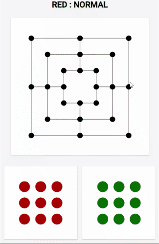
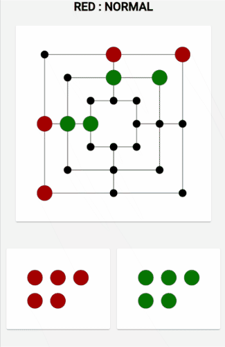
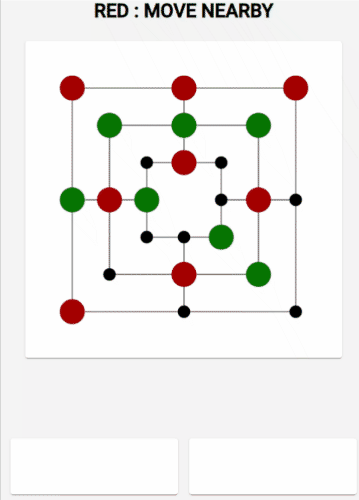
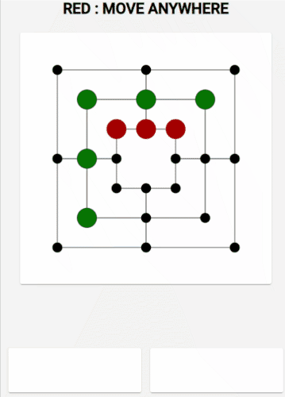

# NineMensMorris
This project is realization of task for Uni 'Artificial Intelligence' course.

## How to run

Run `npm install` and then `ng serve` for a dev server. 
Navigate to `http://localhost:4200/`. 

## Demo
Game is available online under [https://kp-marczynski.github.io/si-nine-mens-morris/](https://kp-marczynski.github.io/si-nine-mens-morris/) . 

### Normal move:

### Mill:

### Move nearby:

### Move anywhere:

## Tests to perform
    green, mm, n vs red, mm, n
    green, mm, o vs red, mm, n
    green, mm, n vs red, mm, o
    green, mm, o vs red, mm, o
    
    green, ab, n vs red, mm, n
    green, ab, o vs red, mm, n
    green, ab, n vs red, mm, o
    green, ab, o vs red, mm, o
    
    green, mm, n vs red, ab, n
    green, mm, o vs red, ab, n
    green, mm, n vs red, ab, o
    green, mm, o vs red, ab, o
    
    green, ab, n vs red, ab, n
    green, ab, o vs red, ab, n
    green, ab, n vs red, ab, o
    green, ab, o vs red, ab, o
